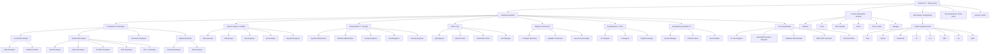

# taksonomia

```mermaid
graph TD
    A["Branża ICT – Oferty pracy"]

    A1["Rodzaj stanowiska"]
    A2["Poziom stanowiska: seniority"]
    A3["Technologie / kompetencje"]
    A4["Typ zatrudnienia / forma pracy"]
    A5["Branża / sektor"]

    A --> A1
    A --> A2
    A --> A3
    A --> A4
    A --> A5

    %% Rodzaj stanowiska
    A1 --> B1["Programista / Deweloper"]
    B1 --> C1["Frontend Developer"]
    C1 --> D1["Web Developer"]
    C1 --> D2["Mobile Frontend"]
    B1 --> C2["Backend Developer"]
    C2 --> D3["Java Developer"]
    C2 --> D4["Python Developer"]
    C2 --> D5["C#/.NET Developer"]
    C2 --> D6["PHP Developer"]
    C2 --> D7["C/C++ Developer"]
    B1 --> C3["Full Stack Developer"]
    B1 --> C4["Mobile Developer"]
    C4 --> D8["Android Developer"]
    C4 --> D9["iOS Developer"]

    A1 --> B2["Inżynier danych / Analityk"]
    B2 --> C5["Data Scientist"]
    B2 --> C6["Data Analyst"]
    B2 --> C7["Data Engineer"]
    B2 --> C8["BI Developer"]
    B2 --> C9["Big Data Engineer"]

    A1 --> B3["Administrator IT / DevOps"]
    B3 --> C10["System Administrator"]
    B3 --> C11["Network Administrator"]
    B3 --> C12["DevOps Engineer"]
    B3 --> C13["Cloud Engineer"]
    B3 --> C14["Security Engineer"]

    A1 --> B4["Tester / QA"]
    B4 --> C15["QA Engineer"]
    B4 --> C16["Manual Tester"]
    B4 --> C17["Automation Tester"]
    B4 --> C18["Test Manager"]

    A1 --> B5["Wsparcie techniczne"]
    B5 --> C19["IT Support Specialist"]
    B5 --> C20["Helpdesk Technician"]
    B5 --> C21["Service Desk Analyst"]

    A1 --> B6["Projektowanie / UX-UI"]
    B6 --> C22["UX Designer"]
    B6 --> C23["UI Designer"]
    B6 --> C24["Graphic Designer"]

    A1 --> B7["Zarządzanie projektami IT"]
    B7 --> C25["Project Manager"]
    B7 --> C26["Product Owner"]
    B7 --> C27["Scrum Master"]

    A1 --> B8["Inne specjalizacje"]
    B8 --> C28["AI / ML Engineer"]
    B8 --> C29["Embedded Systems Engineer"]
    B8 --> C30["Database Administrator"]
    B8 --> C31["CRM / ERP Specialist"]
    B8 --> C32["Technical Writer"]

    %% Seniority
    A2 --> D10["Stażysta"]
    A2 --> D11["Junior"]
    A2 --> D12["Mid / Regular"]
    A2 --> D13["Senior"]
    A2 --> D14["Team Leader"]
    A2 --> D15["Manager"]

    %% Technologie
    A3 --> B9["Języki programowania"]
    B9 --> C33["Java"]
    B9 --> C34["Python"]
    B9 --> C35["JavaScript"]
    B9 --> C36["C#"]
    B9 --> C37["C++"]
    B9 --> C38["PHP"]
    B9 --> C39["Go"]
    B9 --> C40["Swift"]
```
